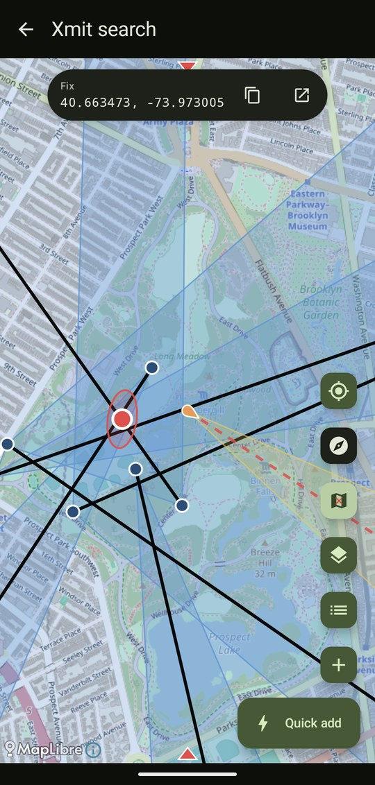
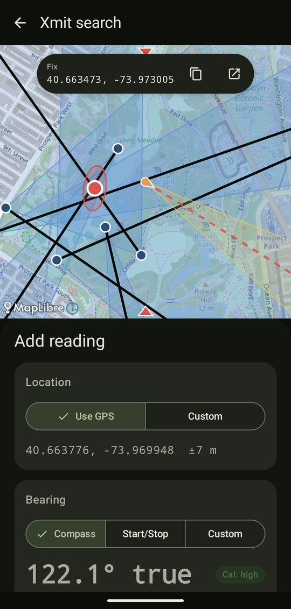
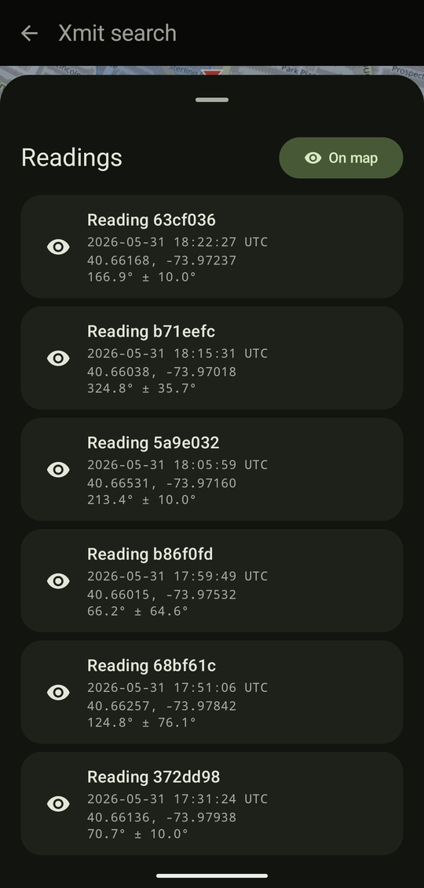
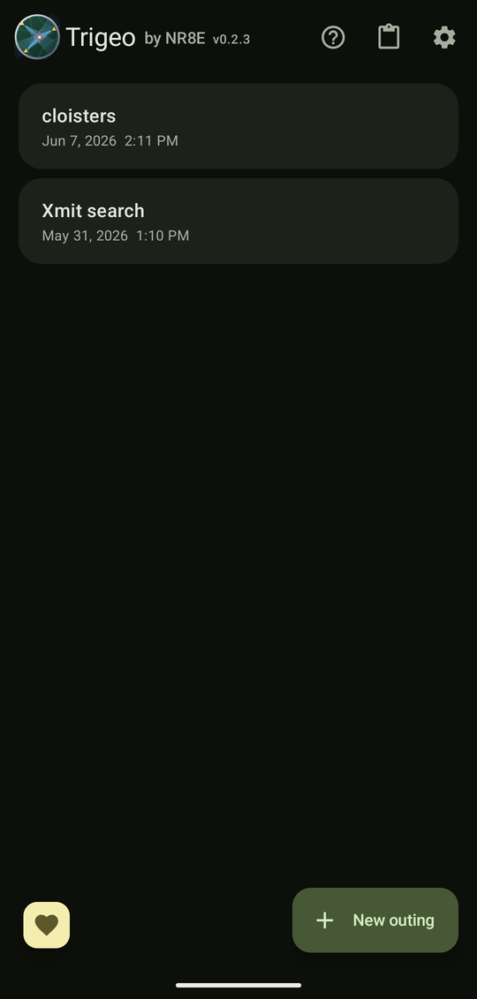

# Trigeo

A pocket triangulation tool for amateur radio operators on transmitter hunts by Evan Boyar, [NR8E](https://www.qrz.com/db/NR8E). Take a point and a bearing, and Trigeo draws the cone on a map. Take a few of them and it computes the intersection so you can head toward where the transmitter most likely is, without paper or a separate compass.

Everything runs locally on your phone. This manual is also available inside the app, behind the ? button on the home screen.

[If you like, you can thank me with a small donation!](https://buymeacoffee.com/elbow)

[A friend has made an iOS port](https://github.com/morria/trigeo), check it out!

  
  
  
  

## The flow

1. **Make an outing.** Each hunt is its own outing. Name it or leave it untitled.
2. **Take readings.** A reading is a point plus a bearing. The point defaults to your live GPS, the bearing to your compass. The **Quick add** button captures both in one tap; the smaller add button above it opens the full capture panel where you can override either by typing values, tapping the segmented controls, or long-pressing the map to drop a point at a custom location.
3. **Watch the fix.** Once at least two visible readings have crossing bearings, the X-marks-spot button up top shows a red marker at the weighted least-squares intersection, plus a 2-sigma error ellipse.

## Quick add

The big button at the bottom of the map takes a reading in one tap from your live GPS and compass, then shows a snackbar with Undo in case you fired it by accident. If the phone has no compass, no GPS fix yet, or the compass is still settling, the snackbar tells you what it's waiting for.

With **Start/stop quick capture** turned on in Settings, the button becomes a two-tap flow: tap **Start bearing** where the signal first appears, sweep, then tap **Stop bearing** where it fades. A small X cancels a pending start.

## Capture panel

The smaller add button above Quick add opens the full capture panel, which holds four cards plus an optional name field.

- **Location.** GPS by default. Switch to **Custom** to type a lat/lon, or close the panel and long-press the map.
- **Bearing.** Three modes:
  - *Compass* uses the live heading. Hold the phone steady; flat-vs-upright is detected automatically and corrected.
  - *Start/Stop* is for null-based antennas where you sweep through the signal. Mark the heading where you first hear it and where it fades. Trigeo bisects the two and uses the half-spread as the uncertainty.
  - *Custom* lets you type a center bearing in degrees true.
  A small chip shows the magnetometer's calibration status. If it says "Uncalibrated" or "Cal: low", wave the phone in a figure-8 for a few seconds.
- **Uncertainty.** A slider from 1 to 80 degrees. Defaults to whatever you set in Settings. Tap the number to type an exact value. Hidden in Start/Stop mode, since the spread sets the uncertainty there.
- **Direction.** Three options:
  - *Normal* draws the bearing one way, the way you'd expect.
  - *Bidirectional* is for loop antennas (or any null-based DF technique) where the bearing has a 180-degree ambiguity. Trigeo draws the bearing line and uncertainty cone both ways.
  - *Reversed* flips the bearing 180 degrees while keeping the captured value, for when you know you were aimed at the back null.

## Map controls

The floating buttons on the right edge do, top to bottom:

- **Recenter** (target icon) snaps the camera to your live GPS.
- **Compass-up** (compass icon) rotates the map so the direction you're facing is at the top. Highlighted while it's on.
- **X-marks-spot** toggles the LSQ fix on and off.
- **Layers** opens the basemap picker and the "Download area for offline" entry.
- **Readings** opens the per-reading list.
- **Add reading** (the small +) opens the full capture panel.
- **Quick add** is the big one at the bottom.

The map also shows a live cone from your position in your current compass direction, plus red centerline ticks at the top and bottom edges so you can aim the phone like a sight. If the compass is missing or poorly calibrated, a warning card appears over the map.

When the fix is on, a small chip at the top of the map shows the intersection coordinates. Tap the copy icon to put them on the clipboard, or the open-in-maps icon to hand off to Google Maps / OsmAnd / whatever you have.

## Readings list

The Readings button opens a list of every reading in the outing. The eye icon on each row hides that reading (its bearing line, cone, and contribution to the fix all disappear), and the **On map / Hidden** button at the top hides all of them at once. Swipe a row to delete it; a snackbar with Undo appears in case you didn't mean it. Tap a row to edit everything else: coordinates, bearing mode, uncertainty, direction, and name.

## Share and import

Long-press an outing on the home screen and pick **Share**. Trigeo packs the outing and all its readings into a `trigeo:v1:<base64>` token short enough to fit in a text message. The recipient pastes it into the **Import** dialog (clipboard icon on the home top bar) and chooses to create a new outing or merge into an existing one. Duplicate readings (matched by ID) are skipped, so re-importing the same token is safe.

Sharing one reading works the same way from the Edit panel.

The same long-press menu also renames or deletes an outing. Delete asks for confirmation, then still offers an Undo snackbar afterward.

## Offline maps

You can pre-download the basemap for an area before going off-grid:

- From inside an outing: layers FAB → **Download area for offline**.
- Without an outing: Settings → **Add region**.

Pick the area, set a zoom range (11-16 is a typical compromise of detail vs size), and tap Download. Saved regions live in Settings and persist across app restarts. Cancel cleans up the partial download.

The fine print: OpenStreetMap and OpenTopoMap public tile servers ask that you don't hammer them with bulk downloads. Trigeo is designed for individual operators picking small areas at moderate zoom; don't pick the whole continent at z18.

## Settings

- **Default reading direction.** Normal, Bidirectional, or Reversed for new readings.
- **Default uncertainty.** Starting half-cone width. Tap the slider's number to type an exact value (this works on every slider in the app).
- **Start/stop quick capture.** Turns the Quick add button into the two-tap start/stop flow.
- **Close-range floor.** Stops a single very close bearing from taking over the fix. Default 25 m.
- **Offline map regions.** Saved regions with their sizes; Add region opens the picker.
- **Show tip button.** Hides the heart button on the home screen.

## Coordinates and precision

- Bearings are stored as true north, with the local magnetic declination from the World Magnetic Model applied at the reading's location.
- Coordinates display at 6 decimal places (~10 cm precision). The triangulation math projects into a local east-north meter frame around the centroid, so it's accurate over the kilometers-scale areas typical of transmitter hunts.
- The fix weights closer readings more heavily: a fixed angular error covers less ground the nearer you are, so a near bearing pins the spot harder than a far one (and a sharp cone harder than a wide one). The **Close-range floor** in Settings limits how much a single very close reading can take over. The 2-sigma error ellipse comes from the same weighting and grows when the bearings disagree.
- Bearings are treated as lines, not rays. A fix can land behind a non-bidirectional reading if the geometry says so, which is usually a hint that someone aimed at the back null.

## Build

`./gradlew :app:assembleDebug` builds a debug APK. Min SDK is 31 (Android 12). Tests run with `./gradlew :app:testDebugUnitTest`.

## License

Copyright 2026 Evan Boyar

THE SOFTWARE IS PROVIDED “AS IS”, WITHOUT WARRANTY OF ANY KIND, EXPRESS OR IMPLIED, INCLUDING BUT NOT LIMITED TO THE WARRANTIES OF MERCHANTABILITY, FITNESS FOR A PARTICULAR PURPOSE AND NONINFRINGEMENT. IN NO EVENT SHALL THE AUTHORS OR COPYRIGHT HOLDERS BE LIABLE FOR ANY CLAIM, DAMAGES OR OTHER LIABILITY, WHETHER IN AN ACTION OF CONTRACT, TORT OR OTHERWISE, ARISING FROM, OUT OF OR IN CONNECTION WITH THE SOFTWARE OR THE USE OR OTHER DEALINGS IN THE SOFTWARE.
